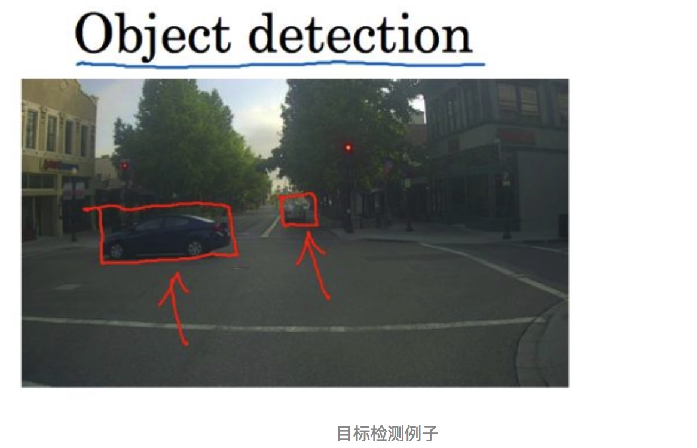
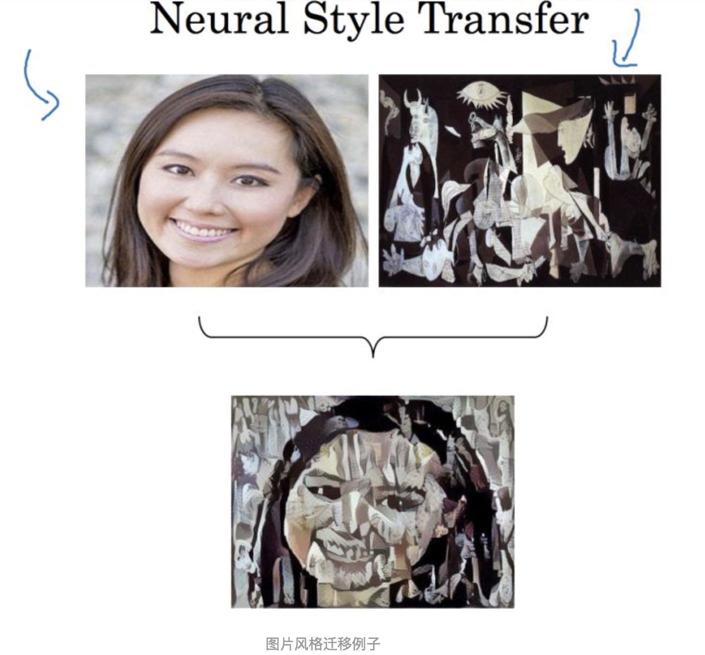
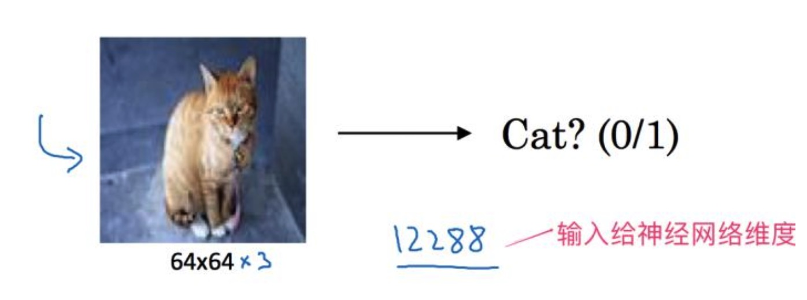

# 0 前言
好久没有像之前写统计学习方法那样做过总结了，打算对吴恩达老师的Deeplearning课程做一个笔记回顾，大体整理思路为吴老师课堂内容和个人理解，非常基础，重在备忘分享，大神勿喷！

开始进行卷积神经网络的学习

# 一、计算机视觉近年发展飞速
深度学习和如今大量数据的提供，促进了计算机视觉的飞速发展。

这门技术可以帮助汽车，查明周围的行人和汽车，并帮助汽车避开它们。还使得人脸识别技术变得更加效率和精准，我们当下人脸识别技术就已经应用到很多场景，如人脸支付，驾校报名人脸报名等等。听起来非常的amazing，下面我们开始来介绍计算机视觉的基础任务，让我们开始学习吧。

* **目标检测**

**计算机视觉中还有个基础任务是目标检测**

比如在一个无人驾驶项目中，**你不一定非得识别出图片中的物体是车辆，但你需要计算出其他车辆的位置，以确保自己能够避开它们。** 所以在目标检测项目中，首先需要识别出图中有哪些物体，比如汽车，还有图片中的其他东西，进而识别出它们在图片中的位置。

比如如下图例子一样，我们需要识别出红色框的物体（当然还有其它物体），这样可以规避障碍，防止车祸。

* **图片风格迁移**

还有一个更有趣的例子，就是神经网络实现的图片风格迁移，比如说你有一张图片，但你想将这张图片转换为另外一种风格。

所以图片风格迁移，就是你有一张满意的图片和一张风格图片，实际上右边这幅画是毕加索的画作，而你可以利用神经网络将它们融合到一起，描绘出一张新的图片。它的整体轮廓来自于左边，却是右边的风格，最后生成下面这张图片。

这种神奇的算法创造出了新的艺术风格，所以在这门课程中，你也能通过学习做到这样的事情。相关实现技术GAN也是目前CV中爆火的算法，如下图：

# 三、计算机视觉面临的挑战
应用计算机视觉时要面临一个挑战，就是数据的输入可能会非常大。ok，比如对于第一个例子图像分类来说，我们很自然的想到使用传统神经网络去处理。

假如我们处理的是64×64的小图片，由于每张图片都有3个颜色通道（RGB），它的数据量是64×64×3。这样计算一下的话，数据量为12288，因此我们输入给神经网络的特征向量 $x$ 维度为12288。

这其实还能忍，但是如果我们要操作更大的图片，比如一张1000×1000的图片，它足有1兆那么大，但是特征向量的维度达到了1000×1000×3，所以数字将会是300万。看看下面这个猫的眼睛，多么高清，配得上这么大的像素，下图给出图片示例：

因此问题来了，如果你要输入300万的数据量，这就意味着，特征向量 x 的维度高达300万。在第一隐藏层中，你也许会有1000个隐藏单元，所有的权值组成了矩阵 $W_{1}$ 。如果你使用了标准的全连接网络，就像我们在第一门和第二门的课程里说的，这个矩阵的大小将会是1000×300万。也就是有30亿个参数，这是个非常巨大的数字。在参数如此大量的情况下，难以获得足够的数据来防止神经网络发生过拟合，要处理包含30亿参数的神经网络，**巨大的内存我们也吃不消，我现在的乞丐mac电脑才4g内存......。
**
那么怎么办呀，解决不了了吗？不存在的，这也是这门课重点要解决的问题？

# 四、引出卷积神经网络
为了解决上面传统神经网络处理图片参数巨大的问题，我们需要进行卷积计算，它是卷积神经网络中非常重要的一块。下节课中，我会为你介绍如何进行这种运算，我将用年龄检测的例子来向你说明卷积的含义。

